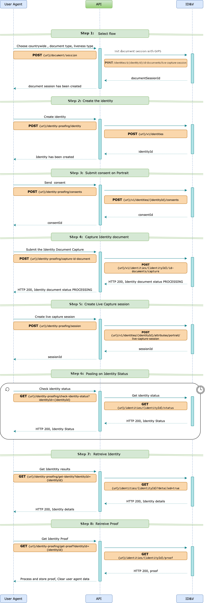
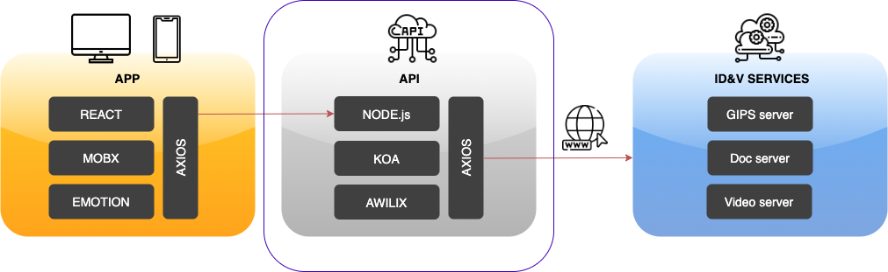

# DOCSERVER & GIPS API MIDDLEWARE

### Preface

This project serves as an example showing how to integrate IDEMIA's GIPS and DOCSERVER APIs into your backend.

### Prerequisites

#### NVM version 0.33 or higher (Optional)

Ignore this step if you're using Windows. On MacOS or Linux you may want to use NVM so that you can have more than one
version of NodeJS installed on your system.

Run

```bash
nvm --version
```

to see if the right version is installed on your machine

If you don't have NVM installed or it's in an older version, run the following command:

```bash
curl -o- https://raw.githubusercontent.com/nvm-sh/nvm/v0.38.0/install.sh | bash
```

to install or update.

#### NodeJS version 14.16.x

###### Windows

Install NodeJS v. 14.16 LTS from https://nodejs.org/en/download/

###### MacOS and Linux

Run

```bash
nvm use 14.16.1
```

If the you don't have this version installed you'll see something like:

```bash
N/A: version "14.16 -> N/A" is not yet installed.
You need to run "nvm install 12.11" to install it before using it.
```

Run

```bash
nvm install 14.16
```

if the required NodeJS version is not installed

#### Yarn

If you are using NVM run:

```bash
nvm use 14.16 && yarn --version
``` 

Otherwise just run:

```bash
yarn --version
``` 

to see if you have yarn installed. If you do, a version number should be printed. If you don't see a version number run
the following command to install yarn:

```bash
npm install -g yarn
```

### Before you begin

1. Use macOS or Linux development environment (you'll save yourself a lot of problems that very few people have even
   tried solving)
2. Use an IDE that supports ECMAScript 6 and JSX syntax higlighting as well as [eslint](https://eslint.org). We are
   using [Visual Studio Code](https://code.visualstudio.com) and it works just fine.
3. This demo uses [NVM (the NodeJS Version Manager)](https://github.com/nvm-sh/nvm) to let you work with the NodeJS
   version we tested it with, without breaking your other NodeJS projects. You'll find an `.nvmrc` file that instructs
   NVM to use node 12.11
4. We recommend to use [yarn](https://yarnpkg.com) to manage the dependencies. You'll find a `yarn.lock` file in the
   codebase so that all the dependencies play well together. You can still try and use good old npm, it'll just be
   slightly slower and you may run into some dependency issues.

### Tech stack:

* koa - [KoaJS](https://koajs.com/#introduction) is a super-lightweight web framework, it's key advantage over express
  is that it leverages `async` functions which let's you avoid the usual callback hell.
* awilix - [Awilix](https://github.com/jeffijoe/awilix) is an IoC container for NodeJS that let's you easily manage
  dependency injection and write clean components without the "glue code".
* axios - Axios is an HTTP client that we're using in this demo to talk to the IDEMIA APIs

### How it is organised

1. `bin` - hosts the "main" script
2. `lib` - hosts modules that initialise various tools (loggers, axios, awilix, yenv, etc) that are used throughout the
   project
3. `middleware` - hosts the Koa middleware modules, typically used to implement the cross-cutting functions such as
   request logging, last-resort error handling etc.
4. `modules/**` - hosts the 'business logic' typically you'll find at least two files in each "module",
   a `*.controller.js` which defines an MVC controller that handles requests to a given REST endpoint and
   a `*.service.js` which defines a business service used by the controller. The service in turn uses the `lib` modules
   and potentially other services to do it's job.
5. `ssl` - hosts the self-signed SSL certificates used to run the Koa server over HTTPS

### How it is configured

We're using [yenv](https://github.com/jeffijoe/yenv) - a YAML based configuration library
+ [keyblade](https://github.com/jeffijoe/keyblade) to fail fast with consistent error messages when key configuration is
missing. You'll find a single YAML config file called `env.yaml` located in the root project directory.

The basic structure of the config is:

```yaml
base:
  PROP_X: value1
  PROP_Y: value2

development:
  ~compose: base
  PROP_Y: overriden_value
```

The structure lets you define a basic configurations and then override certain config variables specifically for your
environment. The example above overrides the value of `PROP_Y` for `NODE_ENV=development`

#### Environment Variables

| name | example value | comment | 
| ---- | ------------- | ------- |
| PORT | 5001 | the HTTPs port the app is listening on |
| LOG_LEVEL | debug/info/warn | the log level used |
| API_DOC_SERVER_URL | https://ipv-api-v2-eu-service.dsa.idemia.io/doc-server/v1 | the url of IDEMIA's doc server instance used | 
| API_DOC_SERVER_KEY | xxxxxxxxxxxxxxxxxxxxxxxxxxx | your doc server API key - you **MUST** set it to use this demo |
|API_GIPS_URL |  https://ipv-api-v2-eu-service.dsa.idemia.io/gips/v1 | the url of IDEMIA's GIPS server instance used |
| API_GIPS_KEY | xxxxxxxxxxxxxxxxxxxxxxxxxxx | your GIPS server API key - you **MUST** set it to use this demo |
| ENABLE_REQUESTS_LOGGER | false | indicates whether incoming requests should be logged to the console. Setting this to `true` affects performance |
| ENABLE_EXT_API_REQUESTS_LOGGER | false | indicates whether requests to IDEMIA APIs should be logged to the console. Setting this to `true` affects performance |

Please visit your IDEMIA developer [dashboard](https://portal.stg.devportal.idemia.io/dashboard) to find out the right
values of the IDEMIA API URLs. In order to access the APIs you'll need access to IDEMIA'
s [Identity Proofing](https://portal.stg.devportal.idemia.io/dashboard/identityproofing/welcome) suite of Products.
You'll find the URLs and API keys in
the [Developers > Tenants(API Keys)](https://portal.stg.devportal.idemia.io/dashboard/identityproofing/developers/tenants#Trial)
section.

### How it works & how it's designed

The flow diagram below explains how this app interacts with its backend and in turn with IDEMIA's ID&V APIs:



The high-level architecture of this demo is shown below:



### A note about SSL

Modern browsers mandate that websites accessed over https only talk to HTTPS APIs. The front end to this API is accessed
over HTTPS, so we've set up Koa to launch under `https://0.0.0.0:5001` and present a self-signed SSL certificate.
Naturally your browser will not trust a self-signed certificate asp when you launch the front end, the very first
request will silently fail (a security warning will be logged to the browser console). To trust our self-signed
certificate, launch the app and visit https://localhost:5001/auth/ssl/ in your browser. The browser will block access to
the page and will present a warning that you're trying to access a website that uses and untrusted certificate.
Different browser present this warning in their own ways, but they all give you an option to trust the certificate and
proceed to the website.

### Self-signed certificate generation

This step is needed only once. Install openssl and execute:

```bash
cd ssl
openssl req -x509 -newkey rsa:2048 -keyout key.pem -out cert.pem -days 3650 -subj '/CN=demo-app' -config openssl.cnf -extensions v3_req -nodes
```

**Note**: This configuration is for development only. In production, you must obtain your server certificate from a
public trusted authority and use a domain name you own.

### How to get it running

0. [Only once] Make sure you have provided the SSL certificate (check the "Self-signed certificate generation" section
   in this README file).
1. If you are using NVM run `nvm use` to switch to the NodeJS version this demo is using. IF you don't have it
   installed, just follow the on-screen instructions
2. Run `yarn install`to install all the dependencies. Don't worry if any warnings pop up. It's probably due to some
   libraries available in more recent versions. It is almost impossible to keep all your dependencies up to date at all
   times. As long as you see a "✨ Done in XX.YYs." message, you should be good to go.
3. Open `env.yaml` and make sure the configuration variables are correct and all API keys/urls are correctly set. You'll
   find the right values for them in IDEMIA's Developer Portal:
    - **API_DOC_SERVER_URL**: docserver api URL (eg. https://ipv-api-v2-eu-service.dsa.idemia.io/doc-server/v1)
    - **API_DOC_SERVER_KEY**: docserver api key (<YOUR_API_KEY>)
    - **API_GIPS_URL**: GIPS api URL (eg. https://ipv-api-v2-eu-service.dsa.idemia.io/gips/v1)
    - **API_GIPS_KEY**: GIPS api key (<YOUR_API_KEY>)

4. Type `yarn dev` to run the app in development mode. This uses `nodemon` so all your `.js` file changes will be picked
   up immediately and will cause `nodemon` to reload the app
