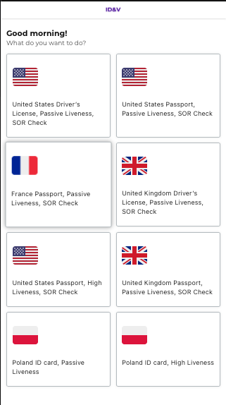
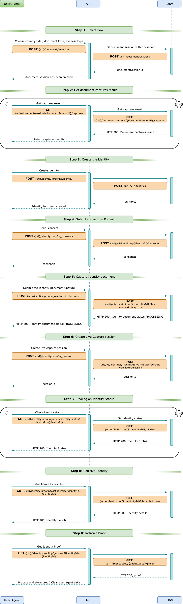
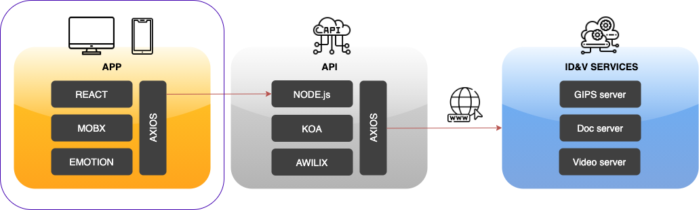

# IDV - document & liveness DEMO

### Prerequisites

#### NVM version 0.33 or higher (Optional)

Ignore this step if you're using Windows. On macOS or Linux you may want to use NVM so that you can have more than one
version of NodeJS installed on your system.

Run

```bash
nvm --version
```

to see if the right version is installed on your machine

If you don't have NVM installed or it's in an older version, run the following command:

```bash
curl -o- https://raw.githubusercontent.com/nvm-sh/nvm/v0.38.0/install.sh | bash
```

to install or update.

#### NodeJS version 14.16.x

###### Windows

Install NodeJS v. 14.16 LTS from https://nodejs.org/en/download/

###### MacOS and Linux

Run

```bash
nvm use 14.16.1
```

If you don't have this version installed you'll see something like:

```bash
N/A: version "14.16 -> N/A" is not yet installed.
You need to run "nvm install 12.11" to install it before using it.
```

Run

```bash
nvm install 14.16
```

if the required NodeJS version is not installed

#### Yarn

If you are using NVM run:

```bash
nvm use 14.16 && yarn --version
``` 

Otherwise just run:

```bash
yarn --version
``` 

to see if you have yarn installed. If you do, a version number should be printed. If you don't see a version number run
the following command to install yarn:

```bash
npm install -g yarn
```

##### Yarn

If you are using NVM run:

```bash
nvm use 14.16 && yarn --version
``` 

Otherwise just run:

```bash
yarn --version
``` 

to see if you have yarn installed. If you do, a version number should be printed. If you don't see a version number run
the following command to install yarn:

```bash
npm install -g yarn
```

### Before you begin

1. Use macOS or Linux development environment (you'll save yourself a lot of problems that very few people have even
   tried solving)
2. Use an IDE that supports ECMAScript 6 and JSX syntax higlighting as well as [eslint](https://eslint.org). We are
   using [Visual Studio Code](https://code.visualstudio.com) and it works just fine.
3. This demo uses [NVM (the NodeJS Version Manager)](https://github.com/nvm-sh/nvm) to let you work with the NodeJS
   version we tested it with, without breaking your other NodeJS projects. You'll find an `.nvmrc` file that instructs
   NVM to use node 12.11
4. We recommend to use [yarn](https://yarnpkg.com) to manage the dependencies. You'll find a `yarn.lock` file in the
   codebase so that all the dependencies play well together. You can still try and use good old npm, it'll just be
   slightly slower and you may run into some dependency issues.

### The Stack

1. react - this demo is using React for the presentation layer
2. mobx 6 - we're using Mobx to manage the state of the components and to pull data
3. emotion - to style the components
4. axios - Axios is used to do the REST
5. linter + prettier - for the code to be prettier
6. webpack - to get it all up and running

### How it is organised

1. `config` - all the magic webpack configuration that no-one really understands, but it just has to be there
2. `public` - the main `index.html` sits here as well as the favicons, the robots.txt, the manifest etc.
3. `scripts` - the webpack build scripts
4. `src/_app` - the app routes and the Axios-powered API access module
5. `src/_assets` - icons, animations, images and the like
6. `src/_constants` - various constants and fixed 'structs' logically (we think) grouped into modules,
7. `src/_utils` - general purpose utility functions (and a bag for "everything else" that did not "fit" into all the
   other folders)
8. `src/components` - reusable (and dumb) "presentational" React components (Buttons, Inputs, Loaders, Headers, Lists,
   etc.)
9. `src/containers` - "less reusable" container components (they use mobx stores to fetch data and render it in the
   presentational components)
10. `src/stores` - the mobx stores
11. `src/translations` - the copy

### How it is configured

We're using [dotenv](https://github.com/motdotla/dotenv) to manage the compile time configuration. You'll find two
configuration files:

- `.env.development` - it is used when you run the demo locally (with `NODE_ENV=development`)
- `.env.production` - it is used when you build a distributable to put on a CDN or run in a nginx

#### Environment Variables

| name | example value | comment |
| ------ | ------ | ------ |
|`REACT_APP_API_URL` | `https://192.168.2.64:5001` | The url of the API server. You'll want to replace the IP address with an IP of your development environment. Ideally you should use an IP address that's reachable over your local network (not 127.0.0.1) so that you can play with the demo on your mobile device|
| `REACT_APP_WEBSOCKET` | `https://192.168.2.64:5001` | In additional to REST. The React app talks to the API over WebSockets. Again you'll want to replace the IP address with an address that's reachable over your local WiFi |
| `REACT_APP_BASE_URL` | `https://192.168.2.64:3000` | The root URL of **this** React app. Again the IP... |
| `REACT_APP_DOCSERVER_URL`  | `https://ipv-api-v2-eu-service.dsa.idemia.io:443/doc-server` | The URL of IDEMIA's  Doc Server that does all the magic to "OCR" your documents |
| `REACT_APP_VIDEOSERVER_URL` | `https://ipv-api-v2-eu-service.dsa.idemia.io:443/video-server` | The URL of IDEMIA's Video Server that recognizes your face |
| `REACT_APP_SDK_PATH` | `https://ipv-api-v2-eu-service.dsa.idemia.io:443` | The URL where the React App will look for the IDEMIA's JS SDKs |

Please visit your IDEMIA developer [dashboard](https://portal.stg.devportal.idemia.io/dashboard) to find out the right
values of the IDEMIA API URLs. In order to access the APIs you'll need access to IDEMIA'
s [Identity Proofing](https://portal.stg.devportal.idemia.io/dashboard/identityproofing/welcome) suite of Products.
You'll find the URLs in
the [Developers > Tenants(API Keys)](https://portal.stg.devportal.idemia.io/dashboard/identityproofing/developers/tenants#Trial)
section.

#### Configuring document types, countries and liveness check type

The suported document type / country / liveness check configurations are listed in the homepage:



The available configurations are listed in a configuration file `./src/_constants/verifications.js`.

A single entry has the following format (the attributes of a single entry a described in the table below):

```
  {
    id: 1,
    flag: '🇺🇸',
    methods: [
      methods.unitedStatesDriversLicense,
      methods.passiveLiveness,
      methods.SORCheck,
    ],
    countryCode: 'USA',
    docType: 'DRIVING_LICENSE',
    livenessType: 'LIVENESS_PASSIVE',
    sorCheck: true,
    docSides: [
      { id: 'SIDE1', name: 'FRONT' },
      { id: 'SIDE2', name: 'BACK' },
    ],
  },
```

| attribute name | type | comment |
| -------------- | ---- | ------- |
| `id` | integer | the "order of appearance" a lower number means the item appears higher in the page |
| `flag` | string | a country flag corresponding to this configuration. For simplicity we are using flag emojis (https://emojipedia.org/flags/)|
| `methods` | array of strings | a set of translations (see `./src/translations/en.json`) that describes this configuration |
| `countryCode` | string | an ISO 3166-1 alpha-3 (3-letter) country code for this configuration  |
| `docType` | string | the type of document used in this configuration (allowed values: `PASSPORT`, `DRIVING_LICENSE`, `IDENTITY_CARD`) |
| `livenessType` | string | the type of liveness test used in this configuration (allowed values: `LIVENESS_PASSIVE`, `LIVENESS_HIGH`)|
| `sorCheck` | boolean | whether or not a statement of record check is run in this configuration |
| `docSides` | array of objects | an array of objects describing the scanned document pages. each object in the array has an `id` attribute (allowed values: `SIDE1`, `SIDE2`, ..., `SIDEN`) and a `name` attribute (allowed values: `FRONT` - for the front page of a document, `BACK` - for the back page of a document, `INSIDE_PAGE` - for the inside page of a document) |

### How it works & how it's designed

The flow diagram below explains how this app interacts with its backend and in turn with IDEMIA's ID&V APIs:



The high-level architecture of this demo is shown below:



### A note about SSL

Modern browsers mandate that websites are accessed over https if they want to launch your device's camera. We've set up
WebPack to launch the app under `https://0.0.0.0:3000` and present a self-signed SSL certificate. Naturally your browser
will not trust a self-signed certificate and will issue a security warning, but it will give you an option to trust this
certificate and proceed. As per `REACT_APP_API_URL` setting the React App will talk to a local API instance over HTTPS
as well. The API instance again uses a self-signed certificate so before you are able to fully use the demo you will
have to open `REACT_APP_API_URL` URL in the browser and trust its self-signed certificate as well. TLDR; - this is what
you need to do:

1. visit `${REACT_APP_BASE_URL}` (https://192.168.2.64:3000 for the example values above) to trust and accept the
   self-signed SSLcertificate for the front end (**this**) app
2. visit `${REACT_APP_API_URL}/auth/ssl` using the above config examples this would
   be https://192.168.2.64:5001/auth/ssl/ to accept the self-signed SSL certificate used by your local API instance.

You'll also have to go through a similar procedure on your mobile device but the app will guide you through this.

### How to get it running

0. [Only once] Follow instructions for `idv-api`. Copy generated `cert.pem` and `key.pem` from `../idv-api/ssl`
   into `config` directory.
1. If you are using NVM run `nvm use` to switch to the NodeJS version this demo is using. IF you don't have it
   installed, just follow the on-screen instructions
2. Install yarn by running `npm install -g yarn`
3. Run `yarn install`to install all the dependencies. Don't worry if any warnings pop up. It's probably due to some
   libraries available in more recent versions. It is almost impossible to keep all your dependencies up to date at all
   times. As long as you see a "✨ Done in XX.YYs." message, you should be good to go.
4. Run `yarn start:ssl` to run app in development mode. It'll open up `https://localhost:3000` in your browser
   automatically
